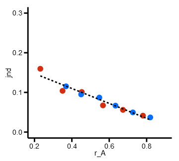
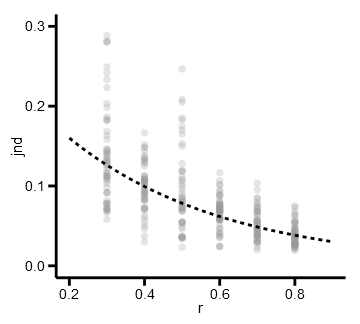
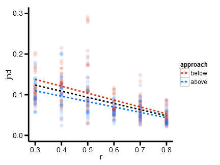
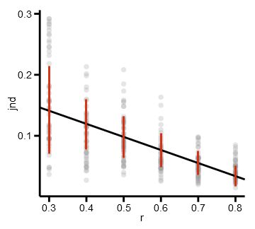
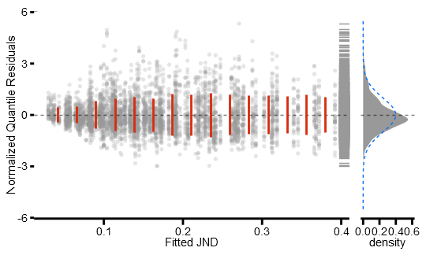
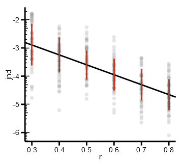
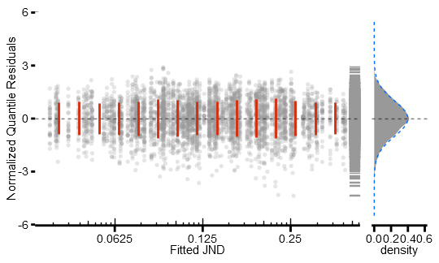
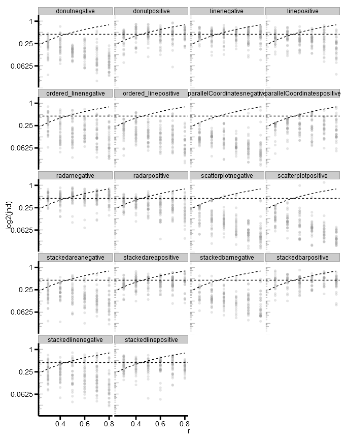
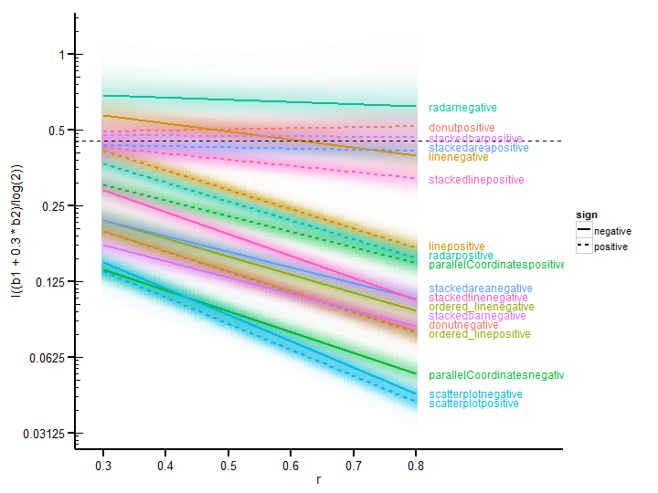
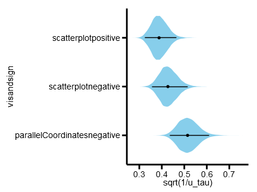

# Supplementary materials for _Beyond Weber's Law: A Second Look at Ranking Visualizations of Correlation_

_Matthew Kay ([mjskay@uw.edu](mailto:mjskay@uw.edu))_<br>
_Jeffrey Heer ([jheer@uw.edu](mailto:jheer@uw.edu))_

This repository contains supplemetary material for _Beyond Weber's Law: A Second Look at Ranking Visualizations of Correlation_ [[1](#kay2015)].

The data in this repository ([data/master.csv](data/master.csv)) is taken from [Harrison _et al._'s materials](https://github.com/TuftsVALT/ranking-correlation) [[2](#harrison2014)].
The analysis here was largely written separately from the analysis in that repository.

This repostory contains:

* [README.md](README.md)|[.html](README.html): This file, generated from [README.Rmd](README.Rmd), which describes
  the analyses from this paper using R code and associated output (below).
* [data/master.csv](data/master.csv): Data from [Harrison _et al._](https://github.com/TuftsVALT/ranking-correlation)
* [src/](src/): Additional R files for the analysis (referred to in context below)
* [output/](output/): Output from the analysis, including figures used in the paper and the Bayesian model ([output/bayesian_model.RData](output/bayesian_model.RData)).
* [figure/](figure/): Figures output by compiling [README.Rmd](README.Rmd) and used in this file.

The rest of this file details the analyses from our paper [[1](#kay2015)].

## Libraries needed for these analyses


The following necessary libraries are available on CRAN, and can be installed using `install.packages`:


```r
library(Cairo)          # nicer PNG rendering
library(car)            # powerTransform
library(ggplot2)        # ggplot, stat_..., geom_..., etc
library(directlabels)   # geom_dl
library(scales)         # trans_format
library(grid)
library(gtable)
library(plyr)           # ldply
library(magrittr)       # %>%, %<>%
library(dplyr)          # filter, rename, mutate, group_by, ungroup, ...
library(survival)       # Surv
library(gamlss)
library(gamlss.cens)    # cens
library(pander)
library(stringr)        # str_sub
library(runjags)
library(coda)
```

We also use the following libraries available from Github, which can be installed using `devtools::install_github`:


```r
library(tidybayes)      # compose_data, apply_prototypes, extract_samples, compare_levels
                        # to install, run devtools::install_github("mjskay/tidybayes")
library(metabayes)      # metajags
                        # to install, run devtools::install_github("mjskay/metabayes")
```

Finally, some plotting functions used in this file are defined elsewhere for brevity here:


```r
source("src/plot_model.R")
```


# Load and clean data

First, we load and clean the data.


```r
df = read.csv("data/master.csv") %>%

    #clean up column names from original data
    rename(
        r = rbase
    ) %>%

    #calculate values used to derive filtering conditions used in original paper
    group_by(visandsign) %>%
    mutate(
        #proportion of jnd worse than chance
        p_chance = mean(jnd > .45),
        #visandsigns with > 20% observations of jnd worse than chance
        p_chance_cutoff = p_chance > .2
    ) %>%
    group_by(visandsign, r, approach) %>%
    mutate(
        #observations > 3 median-absolute deviations from the median within each group
        mad_cutoff = abs(jnd - median(jnd)) > 3 * mad(jnd)
    ) %>%
    ungroup()
```

We code approach approach as sum-to-zero so that other coefficients can be 
interpreted as relative to the mean of both approaches. We relevel first 
so that `"below" == 1` and `"above" == -1` (this is just to eliminate
a double-negative so that the sign of the coefficient of approach is positive,
makes interpretation slightly simpler)


```r
df$approach = relevel(df$approach, "below")
contrasts(df$approach) = contr.sum
```

We also make a numeric version of the approach coded as sum-to-zero
(this is easier to work with than the factor in many cases, for example
if we want a model we can make predictions from with approach = 0)


```r
df$approach_value = ifelse(df$approach == "above", -1, 1)
```

# Weber-style model versus log-linear model fit to all data

First, let's construct a comparison of the Weber mean-fitting procedure to direct fitting (Fig 1 from the paper).

Let's do the mean-fitting and adjustment described by Harrison _et al._ (after Rensink and Baldridge):


```r
weber_data_df = filter(df, visandsign == "scatterplotpositive", !mad_cutoff)

weber_df = weber_data_df %>%
    group_by(approach, r) %>%
    summarise(jnd = mean(jnd)) %>%
    group_by(r) %>%
    mutate(
        mean_jnd_within_r = mean(jnd),
        r_A = r + ifelse(approach == "above", 0.5, -0.5) * mean_jnd_within_r
    ) 
```

Now let's plot the fit, showing how the means are adjusted:


```r
ggplot(
        weber_data_df,
        aes(x=r, y=jnd)
    ) + 
    geom_point(size=3, alpha=.25, color="#999999") +  
    geom_point(aes(color=approach), data=weber_df, size=5) +
    geom_segment(aes(color=approach, xend=r_A, yend=jnd), data=weber_df, 
        size=1, arrow=arrow(type="closed", length=unit(7, "point"))
    ) +
    scale_color_manual(values=c("#d62d0e", "#066fff"), guide=FALSE) +
    xlim(0.2, 0.9) + ylim(0, 0.3)
```

 

Then do a fit to the means:


```r
ggplot(
        weber_df,
        aes(x=r_A, y=jnd)
    ) + 
    geom_point(aes(color=approach), size=5) +
    stat_smooth(method=lm, se=FALSE, size=1, linetype="dashed", color="black") +
    scale_color_manual(values=c("#d62d0e", "#066fff"), guide=FALSE) +
    xlim(0.2, 0.9) + ylim(0, 0.3)
```

 

By comparison, a log-linear model looks like this:


```r
m = lm(log(jnd) ~ r, data=weber_data_df)
ggplot(
        weber_data_df,
        aes(x=r, y=jnd)
    ) + 
    geom_point(size=3, alpha=.25, color="#999999") +  
    stat_function(fun=function(x) exp(coef(m)[[1]] + x*coef(m)[[2]]), 
        color="black", linetype="dashed", size=1
    ) +
    xlim(0.2, 0.9) + ylim(0, 0.3)
```

 


# Linear model
To understand how to correct for approach, let's see an example of it on parallel coordinates-negative (Fig 2):


```r
df %>%
    filter(visandsign == "parallelCoordinatesnegative", !mad_cutoff) %>%
    ggplot(
        aes(x=r, y=jnd, color=approach)
    ) + 
    geom_point(size=3, alpha=.15) +  
    stat_smooth(method=lm, se=FALSE, size=1, linetype="dashed") +
    stat_smooth(method=lm, se=FALSE, aes(group=NA), size=1, color="black", linetype="dashed") +
    scale_color_manual(values=c("#d62d0e", "#066fff")) +
    ylim(0,0.3)
```

 

Now fit a linear model with the original filter on MAD (> 3 MADs from the
median) and visandsigns with > 20% JNDs worse than chance excluded (Model 1 in the paper).


```r
m.linear = gamlss(jnd ~ r * visandsign * approach,
    sigma.formula = ~ visandsign,
    data=filter(df, !mad_cutoff & !p_chance_cutoff)
    )
```

And examine the fit (JND by r shown for scatterplot-negative, Fig 3A):


```r
plot_model_residuals_by_r(df, m.linear, "scatterplotnegative")
```

 


```r
plot_model_residuals(m.linear)
```

 

# Log-linear model
If we estimate a Box-Cox power transform from the original model, the
confidence interval for λ includes 0 (log transform) and excludes 1
(identity, i.e. the linear model):


```r
bc = powerTransform(jnd ~ r * visandsign * approach, data=filter(df, !mad_cutoff & !p_chance_cutoff))
summary(bc)
```

```
## bcPower Transformation to Normality 
## 
##    Est.Power Std.Err. Wald Lower Bound Wald Upper Bound
## Y1    0.0292   0.0175           -0.005           0.0635
## 
## Likelihood ratio tests about transformation parameters
##                               LRT df       pval
## LR test, lambda = (0)    2.797901  1 0.09438782
## LR test, lambda = (1) 2756.766122  1 0.00000000
```

This suggests a log-linear model (i.e., using log-transformed JND) may perform
better than the linear model. Such a model stabilizes the variance in residuals.
It also addresses the problem of the original model making nonsensical
predictions (like JNDs less than 0). Let's fit that model:


```r
m.loglinear = gamlss(jnd ~ r * visandsign * approach,
    sigma.formula = ~ visandsign,
    data=filter(df, !mad_cutoff & !p_chance_cutoff),
    family=LOGNO
    )
```

And examine the fit (Fig 3B):


```r
plot_model_residuals_by_r(df, m.loglinear, "scatterplotnegative", log_y=TRUE)
```

 


```r
plot_model_residuals(m.loglinear, log_x=TRUE)
```

 

Note that the residuals here are more well-behaved in terms of normality and
scale-location invariance. We also have lower AIC in the log-linear model (-1.1683425 &times; 10<sup>4</sup>)
compared to the linear model: (-1.0036835 &times; 10<sup>4</sup>).


```r
AIC(m.linear, m.loglinear)
```


|      &nbsp;       |  df  |  AIC   |
|:-----------------:|:----:|:------:|
|  **m.loglinear**  |  60  | -11683 |
|   **m.linear**    |  60  | -10037 |


# Log-linear model with censoring
Next, let's look at some data to decide what to censor. With approach _from above_ (compare to Fig 5 in paper):


```r
df %>%
    filter(approach=="above") %>%
    ggplot(
        aes(x=r, y=log2(jnd))
    ) + 
    geom_point(alpha=.25, size=2, color="#999999") + 
    geom_hline(yintercept=log2(.45), lty="dashed") + 
    stat_function(fun=function(x) log2(1 - x), lty="dashed", color="black") +
    annotation_logticks(sides="l", alpha=0.25) +
    scale_y_continuous(
        labels=trans_format(function(x) 2^x, math_format(.x))) +
    xlim(0.25,0.8) +
    facet_wrap(~visandsign, ncol=4)
```

 

And with approach _from below_ (compare to Fig 6 in paper):


```r
df %>%
    filter(approach=="below") %>%
    ggplot(
        aes(x=r, y=log2(jnd))
    ) + 
    geom_point(alpha=.25, size=2, color="#999999") + 
    geom_hline(yintercept=log2(.45), lty="dashed") + 
    stat_function(fun=function(x) log2(x), lty="dashed", color="black") + 
    annotation_logticks(sides="l", alpha=0.25) +
    scale_y_continuous(
        labels=trans_format(function(x) 2^x, math_format(.x))) +
    xlim(0.25,0.8) +
    facet_wrap(~visandsign, ncol=4)
```

 

We want to address outliers through censoring. We remove both cutoffs used in
the original paper, and instead use censoring for values that are close to or
worse than chance, or close to or past the ceiling of JND (from above) and the
floor of JND (from below).

As described in the paper (and with reference to the above two figures), we derive 
the thresholds used for censoring based on observations being above/below the ceiling/floor, and chance:


```r
df %<>% mutate(
    censoring_threshold = ifelse(approach == "below", 
                    pmin(r - .05, .4), 
                    pmin(.95 - r, .4)),
    censored = jnd > censoring_threshold,
    censored_jnd = pmin(jnd, censoring_threshold)
)
```

Then, we build the censored model.


```r
m.censored = gamlss(Surv(censored_jnd, !censored) ~ r * visandsign * approach_value,
    sigma.formula = ~ visandsign,
    data=df,
    family=cens(LOGNO)
    )
```

Now let's compare to a non-censored model also fit to all data (without cutoffs from Harrison _et al._).
First we fit the log-linear model without censoring or cutoffs:


```r
m.loglinear.all = gamlss(jnd ~ r * visandsign * approach_value,
    sigma.formula = ~ visandsign,
    data=df,
    family=LOGNO
    )
```

Then we'll generate fit lines from both models:


```r
models = list(uncensored=m.loglinear.all, censored=m.censored)
model_fits = ldply(c("uncensored", "censored"), function(m) {
    expand.grid(r=c(.2, .9), visandsign=levels(df$visandsign)) %>%
    mutate(approach_value = 0) %>%
    cbind(prediction = predict(models[[m]], newdata=.)) %>%
    mutate(model = m)
})
```

Finally, we'll plot the fit for each condition, with and without censoring
(compare to Fig 7 in paper):


```r
ggplot(
        df,
        aes(x=r, y=log2(jnd)),
    ) + 
    geom_point(alpha=.25, size=2, color="#999999") + 
    geom_hline(yintercept=log2(.45), lty="dashed") + 
    geom_line(data=model_fits, mapping=aes(y=prediction/log(2), color=model)) + 
    annotation_logticks(sides="l", alpha=0.25) +
    scale_y_continuous(
        labels=trans_format(function(x) 2^x, math_format(.x))) +
    facet_wrap(~visandsign, ncol=4)
```

 

Note that when we are far from chance, the models are virtually identical. The improvment
comes when we look at conditions with some or many observations worse than chance (and
especially those conditions omitted from analysis in Harrison et al.).

# Bayesian log-linear model with censoring

The Bayesian model can be fit by running [src/fit_bayesian_model.R](src/fit_bayesian_model.R) (it is not done here
because it takes a bit of time). That file fits a model and
saves it to [output/bayesian_model.RData](output/bayesian_model.RData) (specifically the `fit` variable in that saved environment).

We can load that model:


```r
load(file="output/bayesian_model.RData")
```

First we will decorate the model so that factors (such as `visandsign`) are recovered when we extract data from it:


```r
fit %<>% apply_prototypes(df)
```

Then we get samples of the coefficients of the underlying linear models


```r
b_samples = extract_samples(fit, b[visandsign, ..]) %>%
    mutate( 
        #split vis and sign apart so we can apply aesthetics to them separately
        vis = factor(str_sub(visandsign, end=-9)),
        sign = factor(str_sub(visandsign, start=-8))
    )
b_medians = b_samples %>%
    group_by(visandsign, vis, sign) %>% #vis, sign are redundant here but we want to keep them around
    summarise(b1 = median(b1), b2 = median(b2), b3 = median(b3), b4 = median(b4))
```

Then we generate a curve and gradient for log(mu) by r:


```r
memory.limit(8000)  #we need a decent amount of RAM to do this
pred_r_min = .3
pred_r_max = .8
pred_r_step = .1/8
mu_by_r = ldply(seq(pred_r_min, pred_r_max, by = pred_r_step), 
    function(r) within(b_samples, {
        r <- r
        log_mu <- b1 + b2*r
    }))
```

And we plot it, in log space (Fig 8.1):


```r
mu_by_r %>%
    ggplot(
        aes(x=r, y=log_mu/log(2), group=visandsign)
    ) + 
    geom_bin2d(
        aes(alpha=..density.., fill=vis, color=NULL),
        breaks=list(
            x=seq(pred_r_min - pred_r_step/2, pred_r_max + pred_r_step/2, pred_r_step), 
            y=seq(min(mu_by_r$log_mu/log(2)), max(mu_by_r$log_mu/log(2)), length=150)
        )
    ) +
    geom_segment(data=b_medians, aes(x=.3, y=I((b1 + .3 * b2)/log(2)), xend=.8, yend=I((b1 + .8 * b2)/log(2)), color=vis, linetype=sign), size=1) + 
    geom_hline(yintercept=log2(.45), lty="dashed") +
    geom_dl(data=b_medians, aes(y=(b1 + .8 * b2)/log(2), x=.82, color=vis, label=visandsign), method="last.bumpup") +
    scale_alpha_continuous(range=c(0.01,0.6), guide=FALSE) +
    scale_color_discrete(guide=FALSE) +
    scale_fill_discrete(guide=FALSE) +
    scale_y_continuous(labels=trans_format(function(x) 2^x, math_format(.x))) +
    scale_x_continuous(breaks=seq(0.3,0.8,by=0.1), limits=c(0.3,1)) +
    annotation_logticks(sides="l")
```

 

We can group the conditions, and examine their typical differences in log(mu) (Fig 8.3):


```r
extract_samples(fit, typical_mu[visandsign] | visandsign) %>%
    mutate(     #group by partial ranking
        group1 = rowMeans(cbind(scatterplotnegative, scatterplotpositive, parallelCoordinatesnegative)),
        group2 = rowMeans(cbind(ordered_linepositive, donutnegative, stackedbarnegative, ordered_linenegative, stackedlinenegative, stackedareanegative)),
        group3 = rowMeans(cbind(parallelCoordinatespositive, radarpositive, linepositive)),
        group4 = rowMeans(cbind(donutpositive, linenegative, radarnegative, stackedareapositive, stackedbarpositive, stackedlinepositive))
    ) %>%
    with(rbind( #get differences between groups
        data.frame(comparison = "2-1", difference = group2 - group1),
        data.frame(comparison = "3-2", difference = group3 - group2),
        data.frame(comparison = "4-3", difference = group4 - group3)
    )) %>%
    ggeye(aes(x=comparison, y=difference/log(2))) + 
    geom_hline(y=0, lty="dashed")
```

 

We can also examine the between-participant variance for the high-performing group (Fig 9):


```r
extract_samples(fit, u_tau[visandsign]) %>%
    filter(visandsign %in% c("scatterplotpositive","scatterplotnegative","parallelCoordinatesnegative")) %>%
    ggeye(aes(x=visandsign, y=sqrt(1/u_tau)))
```

 

# References

1. <a name="kay2015"></a>M. Kay & J. Heer. _Beyond Weber's Law: A Second Look at Ranking Visualizations of Correlation_, InfoVis 2015.

2. <a name="harrison2014"></a>Harrison, L., Yang, F., Franconeri, S., & Chang, R. _Ranking Visualizations of Correlation Using Weber’s Law_, InfoVis 2014.
